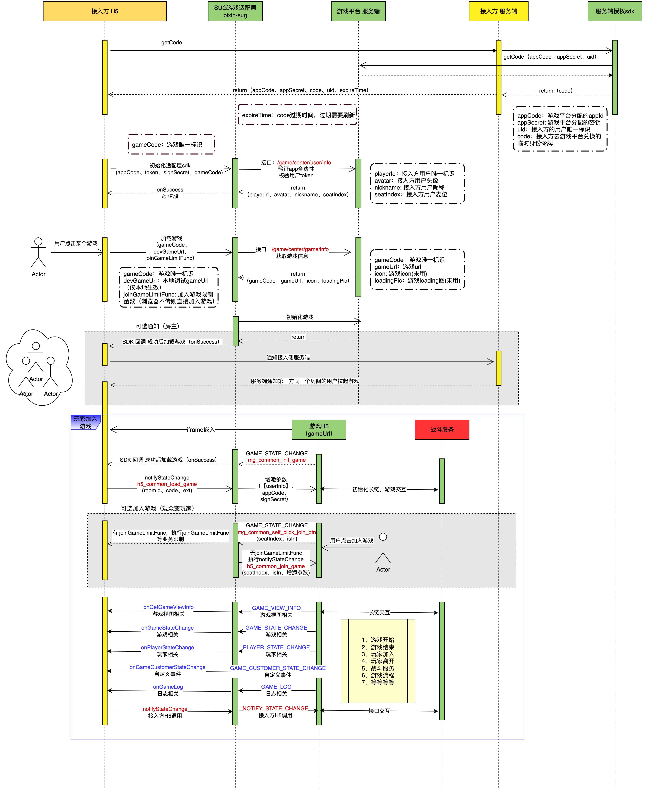

# 开启QuickStart 项目运行
 ```
  npm install

  npm start
 ```
- QuickStart使用bixin-sug实现快速接入游戏；
- 快速接入文档：[快速接入](https://alidocs.dingtalk.com/i/nodes/N7dx2rn0JbZxrG6vSm93Ge6yJMGjLRb3)
- `SDKGameView` 负责login(getCode) --> initSDK --> loadGame

# 三分钟接入游戏

- 第一步：安装bixin-sug
  <details>
  <summary>详细描述</summary>
  
  1. 执行命令 
    ```javascript
      npm install bixin-sug --save
    ```
  </details>

- 第二步：在项目内导入模块SUG
  <details>
  <summary>详细描述</summary>
  

  ``` javascript
    import SUG from 'bixin-sug'

  ```
  </details>

- 第三步：在Demo里面已经有一个成型的[QuickStart](src/common/game.js)个文件，可以直接复制该代码到项目中导入使用
  <details>
  <summary>详细描述</summary>

      1.需要自行实现QuickStart文件内getCode的login（后端服务login/getCode）请求接口的方式
  ```javascript
  _getCode () {
    try {
      // 该接口需要自行实现 替换
      return axios.post('https://gateway.bxyuer.com/game/center/get_code')
    } catch (err) {
      console.log('err', err)
    }
  }
  ```
  </details>
- 第四步：在页面上添加挂在元素
    <details>
    <summary>详细描述 src/pages/Game.js</summary>

    ```html
      <div style={{width: '100vw', height: '100vh'}} id='gameRoot'></div>
    ```
    </details>

- 第五步：加载游戏
    <details>
    <summary>详细描述 src/pages/Game.js</summary>

    ``` javascript
      import { SDKGameView } from "../common/game"
      const gameRoomId = 'xxxx' // 业务自身的roomId
      const gameCode = 'xxxxx' // 接入的游戏code
      useEffect(() => {
        const sdk = new SDKGameView({
          // 获取挂载容器元素
          root: document.querySelector("#gameRoot"),
          gameCode,
          roomId,
      });
        sdk.loadGame({});
  }, []);
    ```
    </details>

# 接入方和SUG SDK调用时序图


